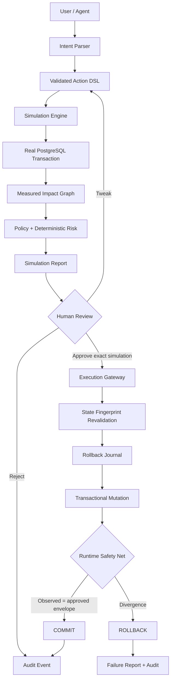

# Foresee — Architecture Snapshot

## Core path



## Safety boundary

```text
Browser
  └─ constrained operation + DSL
       └─ Zod validation
            └─ server-side SQL compiler
                 └─ parameterized PostgreSQL queries
```

The browser never supplies arbitrary SQL and never supplies an execution plan independently of a simulation ID.

## Simulation boundary

```text
BEGIN REPEATABLE READ
  resolve exact targets
  measure dependencies
  DELETE candidate rows
  measure candidate world state
ROLLBACK
```

The DELETE is real; persistence is not. PostgreSQL acts as the world model.

## Approval integrity

Every simulation stores:

- normalized action plan,
- exact affected primary keys,
- relevant mutable state for those keys,
- SHA-256 fingerprint,
- policy result,
- simulation timestamp and expiry.

Execution reloads and locks the same target state and recomputes the fingerprint. A mismatch produces `State changed since simulation. Re-simulation required.`

## Execution boundary

```text
BEGIN SERIALIZABLE
  lock + revalidate target set
  verify simulation fingerprint
  persist ordered rollback journal
  execute exact approved mutation
  measure observed candidate state
  evaluate runtime invariants
  ├─ match      → COMMIT
  └─ divergence → ROLLBACK
```

## Failure architecture

A real PostgreSQL trigger intentionally creates one state transition that the simulation's dependency model does not predict for the `chaos_case` customer. The post-action verifier observes the extra `account_summary` mutation before commit and rolls the whole execution transaction back.

This is the key separation:

**Simulation predicts. Policy decides. Runtime verification confirms. Rollback protects against prediction error.**

## Public-demo isolation

Each browser receives a UUID `session_id`. Business rows and safety metadata all carry that session scope. Reset affects only one session. The public path exposes only a fixed set of demo operations; it does not expose arbitrary database writes.

## Trust properties

| Property | Mechanism |
|---|---|
| No mutation before review | Simulation always rolls back |
| No arbitrary SQL | Constrained DSL + parameterized compiler |
| Simulation changes decision | HIGH-risk Enterprise/MRR case is approval-blocked |
| No stale approval | State fingerprint + target-ID equality + row locks |
| Exact-plan execution | Execution loads immutable stored simulation |
| Prediction errors contained | Post-action verifier before commit |
| Real recovery | Ordered row journal + rollback execution |
| Review traceability | Persistent audit events |
